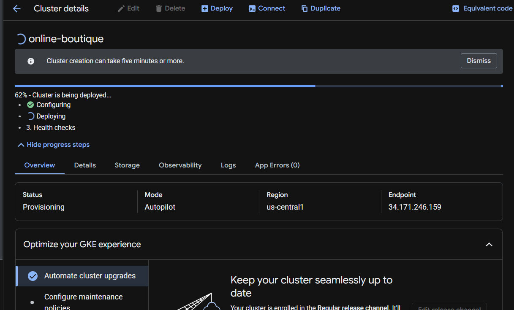
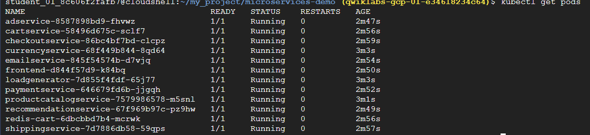
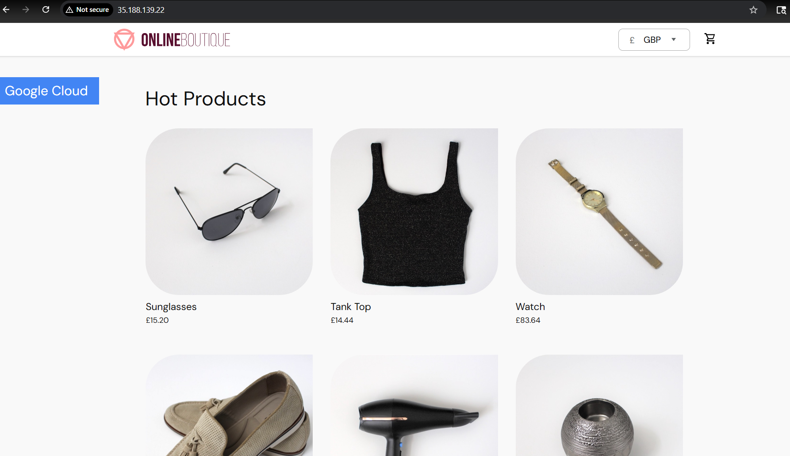
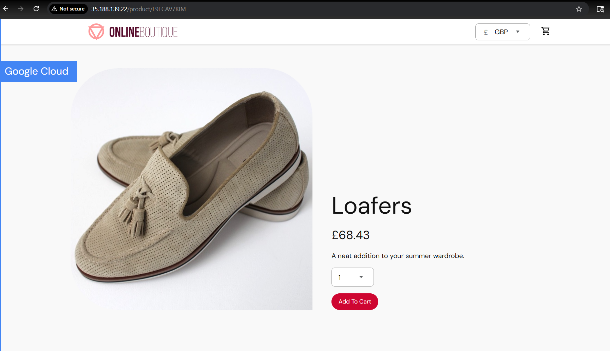

# 🛒 Microservices Deployment on GKE (Online Boutique)

## 📌 Project Overview

This project demonstrates the deployment of a cloud-native microservices-based e-commerce application (**Online Boutique**) on **Google Kubernetes Engine (GKE)**.

The application simulates a real-world shopping platform where users can browse products, add items to a cart, and complete purchases.

> ⚠️ Note: The application source code is provided by Google. This project focuses on **deployment, orchestration, and DevOps implementation on GKE**.

---

## 🏗️ Architecture

The application follows a **microservices architecture**, where each service is independently deployed and communicates over the network.

### Key Components:

* Frontend service (UI)
* Product Catalog service
* Cart service (uses Redis)
* Payment service
* Recommendation service
* Shipping service
* Email service
* Load Generator

---

## ⚙️ Tech Stack

* Google Kubernetes Engine (GKE)
* Kubernetes (Pods, Services)
* Docker Containers
* kubectl CLI
* Google Cloud CLI (gcloud)

---

## 🚀 Implementation Steps

### 1️⃣ Prerequisites

* Google Cloud Project
* gcloud, kubectl, git installed

---

### 2️⃣ Clone Repository

```bash
git clone --depth 1 --branch v0 https://github.com/GoogleCloudPlatform/microservices-demo.git
cd microservices-demo/
```

---

### 3️⃣ Configure Environment

```bash
export PROJECT_ID=<PROJECT_ID>
export REGION=us-central1

gcloud services enable container.googleapis.com \
--project=${PROJECT_ID}
```

---

### 4️⃣ Create GKE Cluster

```bash
gcloud container clusters create-auto online-boutique \
--project=${PROJECT_ID} \
--region=${REGION}
```

---

### 5️⃣ Deploy Application

```bash
kubectl apply -f ./release/kubernetes-manifests.yaml
```

---

### 6️⃣ Verify Deployment

```bash
kubectl get pods
```

Ensure all pods are in **Running** state.

---

### 7️⃣ Access Application

Get external IP:

```bash
kubectl get svc frontend-external
```

Open in browser:

```
http://<EXTERNAL-IP>
```

---

### 8️⃣ Cleanup Resources

```bash
gcloud container clusters delete online-boutique \
--project=${PROJECT_ID} \
--region=${REGION}
```

---

## 📸 Screenshots

(Add your screenshots here)

* GKE Cluster Creation


* Pod Status

* Application UI




---

## 🎯 Key Learnings

* Hands-on experience with GKE cluster creation
* Deployment of microservices using Kubernetes manifests
* Service exposure using LoadBalancer
* Understanding of microservices communication
* Kubernetes resource management (Pods, Services)

---


---

## 📚 Reference

* Original Project: https://github.com/GoogleCloudPlatform/microservices-demo

---

## 👨‍💻 Author

**Ranjithkumar**
DevOps Engineer | GCP | Kubernetes | Terraform

---
