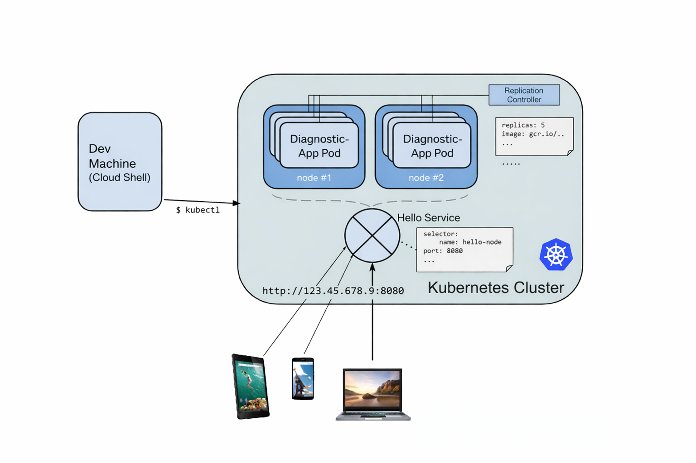
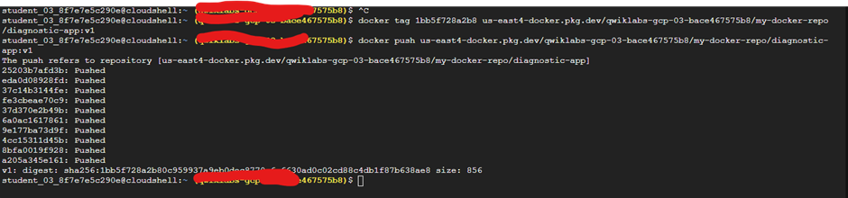
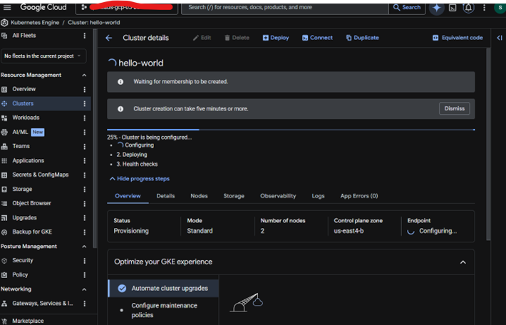
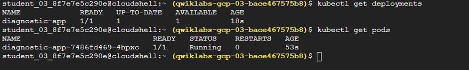
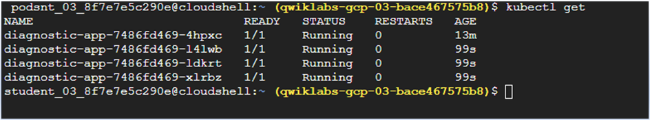
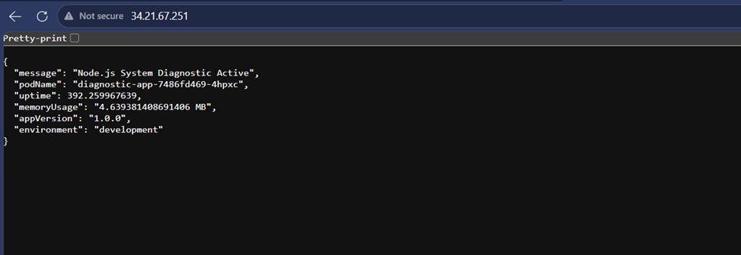

# Cloud-Native Diagnostic Microservice on GKE ☸️

Production-style microservice deployed on Google Kubernetes Engine (GKE) demonstrating containerization, Kubernetes orchestration, health probes, scaling, and cloud-native diagnostics.


This project demonstrates both:

✔ Imperative Kubernetes Management
kubectl create deployment ...
kubectl expose deployment ...

✔ Declarative Kubernetes Management
kubectl apply -f deployment.yaml
kubectl apply -f service.yaml

First focus on Imperative kubernetes management.


---

## 📌 Project Overview

This project exposes:

- System Diagnostics API
- Pod metadata visibility
- Environment variable inspection
- Health Check endpoint (`/healthz`)
- Kubernetes deployment and scaling
- External LoadBalancer exposure

Designed as a lightweight operational debugging microservice for Kubernetes workloads.

---

## 🏗 Architecture





---

## ⚙️ Tech Stack

- Node.js
- Docker
- Kubernetes
- Google Kubernetes Engine (GKE)
- Artifact Registry
- Cloud Load Balancer

---

# Features

## Health Endpoint

```bash
curl http://EXTERNAL-IP/healthz
```

Output

```json
OK
```

---

## Diagnostic Endpoint


curl http://EXTERNAL-IP


Example Output

```json
{
 "message":"Node.js System Diagnostic Active",
 "podName":"diagnostic-app-xyz",
 "uptime":120,
 "memoryUsage":"25 MB",
 "appVersion":"1.0.0",
 "environment":"production"
}
```

---

# Project Structure

```bash
.
├── Dockerfile
├── package.json
├── server.js
├── k8s/
│   └── deployment.yaml
└── README.md
```

---

# Docker Build
```bash
docker build -t gke-diagnostic-app .
```

# Create Google Atifact Registry 

gcloud artifacts repositories create my-docker-repo \
    --repository-format=docker \
    --location=YOUR_REGION \
    --project=YOUR_PROJECT_ID


# Push to Artifact Registry


gcloud auth configure-docker us-east4-docker.pkg.dev

docker tag gke-diagnostic-app \
us-east4-docker.pkg.dev/PROJECT_ID/my-docker-repo/diagnostic-app:v1

docker push us-east4-docker.pkg.dev/PROJECT_ID/my-docker-repo/diagnostic-app:v1

---

# Create GKE Cluster

gcloud container clusters create hello-world \
--num-nodes=2 \
--machine-type=e2-medium \
--zone us-east4-b


# Deploy Application


kubectl create deployment diagnostic-app \
--image=us-east4-docker.pkg.dev/PROJECT_ID/my-docker-repo/diagnostic-app:v1

## Check pods

kubectl get pods
kubectl get deployments


## Scale Application

kubectl scale deployment diagnostic-app --replicas=4


## Expose Service


kubectl expose deployment diagnostic-app \
--type=LoadBalancer \
--port=80 \
--target-port=8080


## Check external IP:

kubectl get svc

# Security Best Practices Implemented

✅ Non-root container user  
✅ Lightweight Alpine base image  
✅ Versioned image tags  
✅ Health checks endpoint  
✅ Minimal attack surface


# Kubernetes Concepts Demonstrated

- Pods
- Deployments
- Replica Scaling
- Services
- LoadBalancers
- Health Checks
- Container Security


# Screenshots

# Push image to Google Artifactory Registry




## GKE Cluster Creation




## Pods Running



## Scale deployment from 1 to 4 pods(running)



## Service External IP



## App Response
Youtube link: https://youtu.be/q1Ta0QvX1IA

---


## Author

Ranjith Kumar  
DevOps | Cloud | Kubernetes | Automation Engineer
